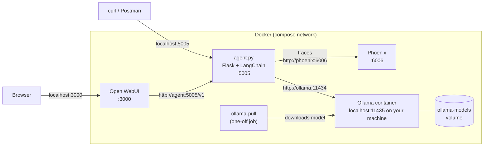
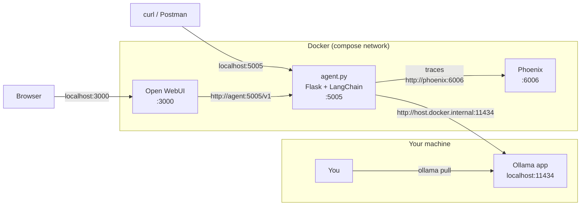

# openwebui-agent

A small LangChain agent that runs on a local Ollama model and shows up as a chat model in [Open WebUI](https://openwebui.com). Every model call and tool call is traced to [Arize Phoenix](https://phoenix.arize.com), so you can see what the agent did and how long each step took.

## What it does

`agent.py` is a Flask app that wraps a LangChain agent:

- **Model**: an Ollama model (default `qwen3.5:0.8b`) accessed through `ChatOllama`.
- **Tools**: `get_current_date`, which returns the current local date and time (time zone from `TZ`).
- **OpenAI-compatible API** (`/v1/models`, `/v1/chat/completions`): Open WebUI connects here as if the agent were an OpenAI model. Responses stream token by token.
- **Streamed reasoning**: thinking models (such as qwen3 / qwen3.5) produce reasoning before they answer. The agent streams it as `reasoning_content`, and Open WebUI shows it in a collapsible **Thinking** section, so you see progress right away instead of a blank screen.
- **Simple test endpoint** (`/chat`): a plain Server-Sent Events endpoint for trying the agent from Postman or curl.
- **Tracing**: every agent run is sent to Phoenix. Open WebUI forwards its chat and user IDs, so Phoenix groups traces by chat session.

### How the pieces connect

The agent, Open WebUI and Phoenix always run in Docker. Where Ollama runs depends on which compose file you start.

#### Ollama in a container (`docker-compose.yml`)

Everything runs in Docker. The agent reaches Ollama by its service name on the compose network. On first start, the `ollama-pull` job downloads the model into the `ollama-models` volume, then exits.



#### Ollama on the host (`docker-compose.laptop.yml`)

There is no Ollama container. The agent leaves the Docker network through `host.docker.internal` to reach the Ollama app installed on your machine. You download models yourself with `ollama pull`.



| Service | URL on your machine | What it's for |
|---|---|---|
| Open WebUI | http://localhost:3000 | Chat interface. The first account you create becomes the admin. |
| Agent API | http://localhost:5005 | The agent. Open WebUI uses it; you can also call it from Postman/curl. |
| Phoenix | http://localhost:6006 | Traces of every agent run. |
| Ollama (container setup only) | http://localhost:11435 | The containerized Ollama. Uses 11435 so it doesn't clash with an Ollama app on 11434. |

## Choose how to run Ollama

There are two compose files. They run the same agent, Open WebUI and Phoenix; they differ only in where Ollama runs.

| | Ollama in a container | Ollama on the host |
|---|---|---|
| Compose file | `docker-compose.yml` | `docker-compose.laptop.yml` |
| Ollama runs | In the `ollama` container | In the Ollama app installed on your machine |
| Agent connects to | `http://ollama:11434` | `http://host.docker.internal:11434` |
| Model download | Automatic on first start | You run `ollama pull` yourself |
| Use when | You want everything self-contained | You already have Ollama installed (and possibly models downloaded), or want Ollama to use your GPU without Docker GPU setup |

> **Why `host.docker.internal` and not `localhost`?** The agent runs inside a container, and inside a container `localhost` means the container itself. `host.docker.internal` is the name Docker gives containers for reaching your machine. Pointing the agent at `localhost:11434` causes `[Errno 111] Connection refused`.

Both files use the same project name (`openwebui-agent`), so Open WebUI accounts, chats and Phoenix traces are kept when you switch between them.

## Prerequisites

- [Docker Desktop](https://www.docker.com/products/docker-desktop/) (or Docker Engine with the Compose plugin).
- For the host setup only: the [Ollama app](https://ollama.com/download) installed and running.

## Setup

1. Open a terminal in this folder:

   ```powershell
   cd C:\Users\cdere\OneDrive\Documents\Python-Projects\openwebui-agent
   ```

2. (Optional) Create a `.env` file to change the model, keys, ports or time zone:

   ```powershell
   copy .env.example .env
   ```

   Then edit `.env`. Without a `.env`, the defaults in the compose files are used. See [Configuration](#configuration).

## Option A: Ollama in a container

Start everything:

```powershell
docker compose up -d --build --remove-orphans
```

On the first start, the `ollama-pull` job downloads the model into the `ollama-models` volume before the agent starts. This can take a few minutes; follow it with:

```powershell
docker compose logs -f ollama-pull
```

Other commands:

```powershell
docker compose ps                  # show what's running
docker compose logs -f agent       # watch the agent's logs
docker compose down                # stop everything (data is kept)
```

**Using a GPU:** the container runs Ollama on the CPU by default. To use an NVIDIA GPU, uncomment the `deploy:` block under the `ollama` service in `docker-compose.yml` (needs Docker Desktop GPU support or the NVIDIA Container Toolkit), then run the `up` command again.

## Option B: Ollama on the host

1. Make sure the Ollama app is running and has the model. Use the same model name the agent is configured for (`qwen3.5:0.8b` unless you set `OLLAMA_MODEL` in `.env`):

   ```powershell
   ollama pull qwen3.5:0.8b
   ollama list                       # confirm it's there
   ```

2. Start everything with the laptop compose file:

   ```powershell
   docker compose -f docker-compose.laptop.yml up -d --build --remove-orphans
   ```

Every compose command for this setup needs `-f docker-compose.laptop.yml`:

```powershell
docker compose -f docker-compose.laptop.yml ps
docker compose -f docker-compose.laptop.yml logs -f agent
docker compose -f docker-compose.laptop.yml down
```

If your Ollama listens somewhere other than port 11434 on this machine, set `LAPTOP_OLLAMA_URL` in `.env`, for example `LAPTOP_OLLAMA_URL=http://host.docker.internal:11500`.

## Switching between the two

Run the other file's `up` command. `--remove-orphans` stops the services the new file doesn't have (for example, the Ollama container when you switch to the host setup). Models already downloaded into the container's volume stay there, so switching back doesn't download them again.

## Using it

### In Open WebUI

1. Open http://localhost:3000 and create an account (the first one becomes the admin).
2. Pick the model in the dropdown. It's listed under the Ollama model name, for example `qwen3.5:0.8b`.
3. Chat. The model's reasoning appears in a collapsible **Thinking** section, followed by the answer.

The connection to the agent is configured automatically by the compose files. Open WebUI only lists the agent, not raw Ollama models (`ENABLE_OLLAMA_API=false`).

### From curl or Postman

These examples are for Windows PowerShell. They use `curl.exe` because plain `curl` there is an alias for `Invoke-WebRequest`, and they pipe the JSON body in (`--data-binary '@-'`) because PowerShell mangles double quotes in command-line arguments. Replace `somekey` with your `AGENT_API_KEY` if you set one.

List models:

```powershell
curl.exe -H "Authorization: Bearer somekey" http://localhost:5005/v1/models
```

Streamed chat completion (OpenAI format):

```powershell
$body = '{"model":"any","stream":true,"messages":[{"role":"user","content":"What is today''s date?"}]}'
$body | curl.exe -N http://localhost:5005/v1/chat/completions `
  -H "Authorization: Bearer somekey" -H "Content-Type: application/json" --data-binary '@-'
```

Simple SSE endpoint (no API key). Send a single `message` or a full `messages` history:

```powershell
$body = '{"message":"Say hi in five words."}'
$body | curl.exe -N http://localhost:5005/chat -H "Content-Type: application/json" --data-binary '@-'
```

On macOS/Linux, pass the JSON directly instead: `curl -N ... -d '{"message":"Say hi in five words."}'`.

It streams `reasoning` events (the model's thinking), `token` events (the answer), then a `done` event, or an `error` event if something fails.

### Viewing traces in Phoenix

Open http://localhost:6006 and select the `openwebui-agent` project. Each request is a trace showing the agent run, each model call and each tool call, with timings. The **Sessions** view groups traces by Open WebUI chat.

Each message you send in Open WebUI usually creates several traces: the chat response plus background requests Open WebUI makes for the chat title, tags and follow-up suggestions.

## Configuration

Set these in `.env` (see `.env.example`). Anything not set uses the default shown.

| Variable | Default | Used by | What it does |
|---|---|---|---|
| `OLLAMA_MODEL` | `qwen3.5:0.8b` | both | Model the agent uses. The container setup downloads it automatically; for the host setup, `ollama pull` it yourself. Also the name shown in Open WebUI. |
| `AGENT_API_KEY` | `somekey` | both | Key Open WebUI sends as `Authorization: Bearer <key>`. Required on the `/v1` endpoints. |
| `WEBUI_SECRET_KEY` | `change-me` | both | Secret Open WebUI uses to sign logins. Set any long random string. |
| `TZ` | `America/New_York` | both | Time zone for `get_current_date` and Open WebUI. |
| `OPENWEBUI_HOST_PORT` | `3000` | both | Port for Open WebUI on your machine. |
| `AGENT_HOST_PORT` | `5005` | both | Port for the agent API on your machine. |
| `PHOENIX_HOST_PORT` | `6006` | both | Port for the Phoenix UI and HTTP trace collector. |
| `PHOENIX_GRPC_HOST_PORT` | `4317` | both | Port for Phoenix's gRPC trace collector. |
| `OLLAMA_HOST_PORT` | `11435` | container only | Port the Ollama container is published on. |
| `LAPTOP_OLLAMA_URL` | `http://host.docker.internal:11434` | host only | Where the agent finds the Ollama app on your machine. |

After changing `.env`, run your setup's `up` command again to apply it.

Agent settings that live in `agent.py` itself: context window (`num_ctx=12000`), `temperature=0.3`, `reasoning=True`, and the system prompt.

## Running the agent without Docker (development)

You can run `agent.py` directly with [uv](https://docs.astral.sh/uv/) while still using Phoenix and Open WebUI from Docker, or on its own for API testing:

```powershell
uv sync
$env:OLLAMA_BASE_URL = "http://localhost:11434"   # the Ollama app on this machine
uv run agent.py
```

Run directly, the agent starts in Flask debug mode on port 5005 and sends traces to `http://localhost:6006/v1/traces`. Stop the `agent` container first so the port is free.

## Troubleshooting

**`[Agent error: [Errno 111] Connection refused]`**
The agent can't reach Ollama.
- Host setup: check the Ollama app is running (`ollama list` should work) and that you started with `-f docker-compose.laptop.yml`. The URL must use `host.docker.internal`, not `localhost`.
- Container setup: check the `ollama` container is healthy with `docker compose ps`.

**Model not found errors**
The model in `OLLAMA_MODEL` isn't downloaded where the agent is looking. For the host setup, run `ollama pull <model>`. For the container setup, run the `up` command again so `ollama-pull` fetches it.

**Responses take a long time**
- Thinking models can reason for a long time before answering, especially on CPU. You should see the **Thinking** section fill in while you wait. For faster answers, use a smaller model, or set `reasoning=False` in `agent.py` to turn thinking off.
- Check whether Ollama is using a GPU: `curl.exe http://localhost:11434/api/ps` (host) or `curl.exe http://localhost:11435/api/ps` (container). `"size_vram": 0` means it's running on CPU only.
- Open WebUI's background requests (titles, tags, follow-up suggestions) go through the same agent and model, and can make your next message wait. Turn them off in Open WebUI under **Admin Settings → Interface**.

**The model doesn't appear in Open WebUI**
Check the agent is running (`docker compose ps`, or with `-f docker-compose.laptop.yml`) and that `AGENT_API_KEY` is the same for both services. Both read it from `.env`, so it matches unless you changed one manually in Open WebUI's admin settings.

## Project files

| File | Purpose |
|---|---|
| `agent.py` | The agent, its tool, and the Flask API. |
| `docker-compose.yml` | Full stack with Ollama in a container. |
| `docker-compose.laptop.yml` | Full stack using the Ollama app on the host. |
| `Dockerfile` | Builds the agent image (Python 3.13 + uv). |
| `.env.example` | Template for `.env` settings. |
| `pyproject.toml`, `uv.lock` | Python dependencies. |
